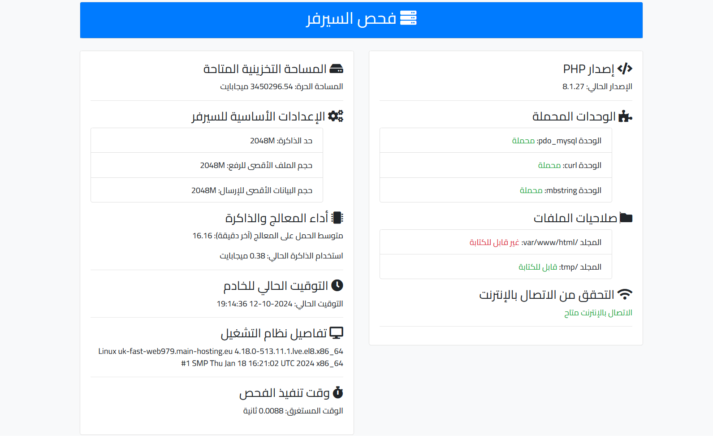

# فحص السيرفر - Server Check



هذا المشروع عبارة عن صفحة ويب بسيطة تقوم بفحص حالة السيرفر وإظهار معلومات مختلفة حول النظام وأدائه. تم تطوير هذه الصفحة باستخدام PHP ومكتبة Bootstrap لواجهة المستخدم، وهي تدعم اللغة العربية.

## المزايا الرئيسية

- **إصدار PHP**: عرض إصدار PHP الحالي.
- **الوحدات المحملة**: التحقق من الوحدات (Modules) المهمة المحملة مثل `pdo_mysql`, `curl`, و `mbstring`.
- **صلاحيات الملفات**: التحقق من صلاحيات الكتابة لبعض المجلدات المهمة.
- **المساحة التخزينية المتاحة**: عرض المساحة الحرة المتاحة على السيرفر.
- **إعدادات PHP الأساسية**: عرض إعدادات مهمة مثل `memory_limit`, `upload_max_filesize`, و `post_max_size`.
- **الاتصال بالإنترنت**: التحقق من إمكانية الاتصال بالإنترنت.
- **أداء المعالج والذاكرة**: تحليل الحمل على المعالج واستخدام الذاكرة.
- **التوقيت الحالي للخادم**: عرض التوقيت الحالي للسيرفر.
- **تفاصيل نظام التشغيل**: عرض معلومات نظام التشغيل.
- **وقت تنفيذ الفحص**: عرض الوقت المستغرق لتنفيذ الفحص.

## كيفية الاستخدام

1. قم بتنزيل أو نسخ ملفات المشروع إلى خادم الويب الخاص بك.
2. تأكد من تثبيت PHP والإصدارات المطلوبة من الوحدات (Modules).
3. قم بفتح الملف `server_check.php` في متصفح الويب الخاص بك.
4. سيتم عرض نتائج الفحص في واجهة مستخدم منظمة وجميلة.

## المتطلبات

- **PHP 7.0 أو أحدث**
- **الخادم**: Apache أو Nginx
- **الوحدات المطلوبة**: `pdo_mysql`, `curl`, `mbstring`

## كيفية التثبيت

1. استنساخ المستودع من GitHub:
   ```sh
   git clone https://github.com/RAKAN-ALYAMI/server_check.git
   ```
2. قم بنقل الملفات إلى مجلد خادم الويب الخاص بك.
3. افتح `server_check.php` في المتصفح.

## حقوق الملكية

جميع الحقوق محفوظة &copy; 2024 - RAKAN ALYAMI

- **Telegram**: [@r7000r](https://t.me/r7000r)
- **Email**: [rakan7777@gmail.com](mailto:rakan7777@gmail.com)

## المساهمة

المساهمات مرحب بها! إذا كان لديك أي أفكار أو تحسينات، لا تتردد في فتح طلب سحب (Pull Request) أو إنشاء مشكلة (Issue).

## الترخيص

هذا المشروع مفتوح المصدر بموجب ترخيص MIT. يرجى مراجعة ملف `LICENSE` لمزيد من التفاصيل.
